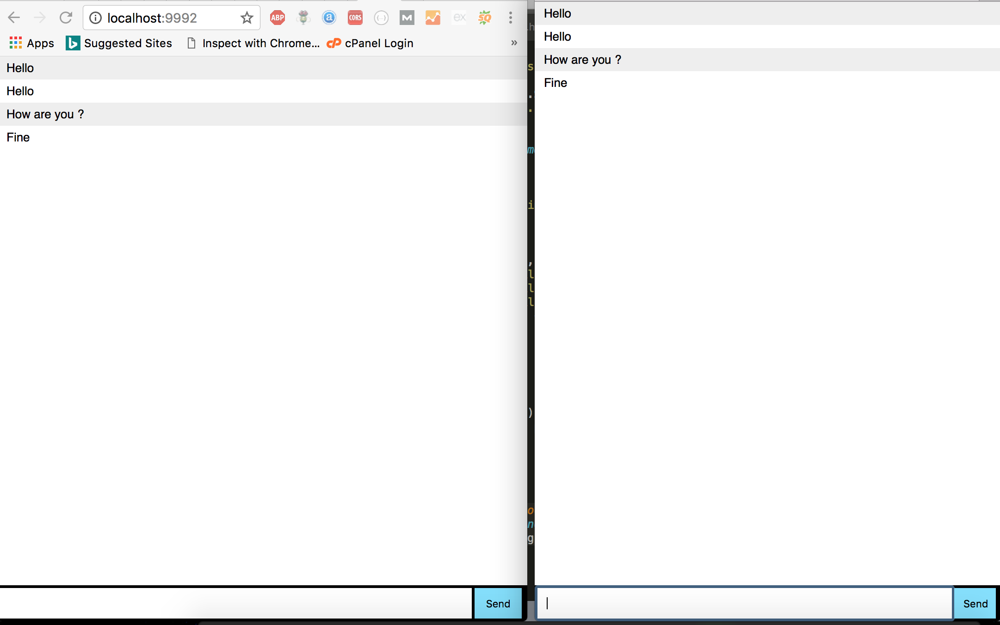

# sockectapinodejs

<iframe width="560" height="315" src="https://www.youtube.com/embed/piuE5rbaQhU" frameborder="0" allow="autoplay; encrypted-media" allowfullscreen></iframe>

# clone this project 
git clone https://github.com/Sudarshan101/sockectapinodejs.git

# install package
npm install

# Run Project 
nodemon server.js

# Result

